<!-- https://www.markdownguide.org/cheat-sheet/ -->

# Proyecto Plataforma Recogida de Paquetes InstaYA

NRC:**2118**

Equipo No. **06**

## Integrantes

- Angel Ernesto De Moya Mugno
- Daniela Alejandra Ospina Rubio
- Daritza Andrea Teherán Viñas
- Javier Mauricio Torres Vargas
- Jesús Antonio Vela Arango

<!-- ### Tutor -->

<!-- • Luis Sebastian Caicedo Pimienta -->

---

<div style="page-break-after: always"></div>

## Tabla de Contenido

- [Proyecto Plataforma Recogida de Paquetes InstaYA](#proyecto-plataforma-recogida-de-paquetes-instaya)
  - [Integrantes](#integrantes)
  - [Tabla de Contenido](#tabla-de-contenido)
  - [Enunciado](#enunciado)
    - [Notas](#notas)
    - [Propuesta Wireframe](#propuesta-wireframe)
  - [Descripción de roles del equipo](#descripción-de-roles-del-equipo)
  - [Diagrama de despliegue](#diagrama-de-despliegue)
  - [Definición de Artefactos - Product Backlog](#definición-de-artefactos---product-backlog)
    - [Método de Estimación Fibonacci](#método-de-estimación-fibonacci)
    - [Product Backlog](#product-backlog)
    - [Sprint Backlog Entrega 1. Planificación](#sprint-backlog-entrega-1-planificación)
    - [Sprint Backlog Entrega 2. Diseño](#sprint-backlog-entrega-2-diseño)
    - [Sprint Backlog Entrega 3. Desarrollo Front-End](#sprint-backlog-entrega-3-desarrollo-front-end)
    - [Sprint Backlog Entrega 4. Desarrollo Back-End](#sprint-backlog-entrega-4-desarrollo-back-end)
  - [Cronograma de Proyecto - Sprint 1](#cronograma-de-proyecto---sprint-1)
  - [Cronograma de Proyecto - Sprint 2](#cronograma-de-proyecto---sprint-2)
  - [Mockups](#mockups)
  - [Mapa de Navegabilidad](#mapa-de-navegabilidad)
  - [Plantilla Bootstrap](#plantilla-bootstrap)
    - [Enlaces](#enlaces)
    - [Import](#import)
  - [Creación proyecto en Git](#creación-proyecto-en-git)
    - [Github](#github)
  - [Requerimientos de Ejecución](#requerimientos-de-ejecución)
  - [Componentes desarrollados](#componentes-desarrollados)
  - [Formularios desarrollados](#formularios-desarrollados)
  - [Cronograma de Proyecto - Sprint 3](#cronograma-de-proyecto---sprint-3)
  - [Solicitudes a la API](#solicitudes-a-la-API)
  - [Listado de dependencias](#listado-de-dependencias)
  - [Funcionalidades o módulos del Back-End](#funcionalidades-o-módulos-del-Back---End)
  - [Despliegue](#Despliegue)

---

<div style="page-break-after: always"></div>

## Enunciado

La empresa **InstaYA** requiere un sistema por medio del cual los usuarios puedan programar la recogida de paquetes para su futuro envío.

Los datos mínimos que requiere la empresa por parte del usuario para recoger el paquete son los siguientes:

• **Dia** y **franja horaria** en la cual se encuentra disponible el `usuario` para atender al personal encargado (Se debe programar con mínimo `24 horas de anticipación`).
• Las dimensiones `ancho x alto x largo`, si es `mercancía delicada o no` y el `peso aproximado`.
• `Dirección` del _lugar de recogida_, incluyendo `ciudad`.
• Número de `identificación personal` y `nombre completo` de _quien envía_.
• `Dirección` del _lugar hacia donde se realiza el envío_, incluyendo `ciudad`, así como el `número de identificación` personal y `nombre completo` de quien _recibe_.
Deben tener en cuenta las siguientes funcionalidades:
• Solo se maneja el `usuario cliente`, quien es el que realizará la _solicitud del servicio_.
• _Por cada envío_ se genera un `código único de seguimiento`.
• Un envío puede tener tres posibles estados: `Guardado` (al crearse), `Cancelado` o `Cumplido`
• **_Los envíos automáticamente se cumplen en 24 horas_**.

### Notas

• Los datos suministrados por los usuarios deben cumplir la política de **_privacidad de datos vigente_**, es decir las **contraseñas** de los usuarios deben almacenarse de forma cifrada y la **conexión al servidor** debe realizarse de forma segura.

> _Se entiende por información personal aquella suministrada por el usuario para el registro, la cual incluye datos como nombre, identificación, edad, género, dirección, correo electrónico y teléfono._[^fn1]

• La base de datos debe ser **no relacional**.
• Se debe utilizar una **arquitectura desacoplada**, es decir, una API back end y un front end que consuma dicha API.
• La API back end debe estar desarrollada en **Express.js**
• El front end debe estar desarrollado en **React.js**
• Se debe utilizar **Bootstrap** como librería CSS para manejar los estilos de su aplicación.

<div style="page-break-after: always"></div>

### Propuesta Wireframe

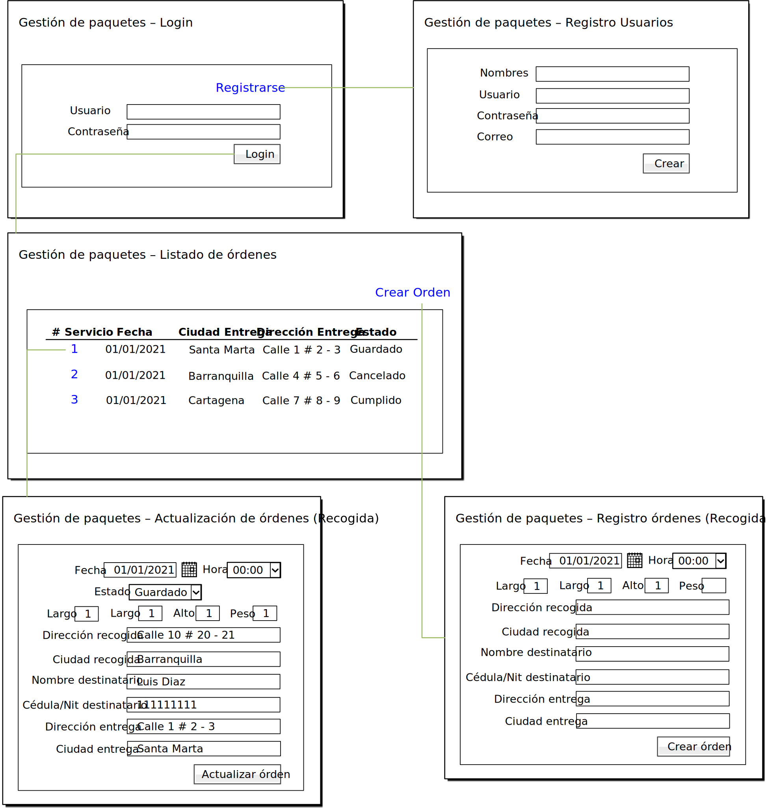

**Diagrama 1** - Propuesta para wireframe del proyecto

[Regresar &#8617;](#tabla-de-contenido)

<div style="page-break-after: always"></div>

## Descripción de roles del equipo

<!-- TODO NOTA Este es el método para diseñar tablas en markdown, no es muy cosmética pero se podría trabajar externo y después se convierte a markdown -->
<!-- prettier-ignore -->
| Rol | Integrante | Descripción | Tareas |
| --- | ---------- | ----------- | ------ |
| Scrum Master    | Tutor<br>DanielaOR<br>DaritzaTV  | Encargados de gestionar y organizar el Scrum | <br>Revisar el cumplimiento de la metodología Scrum<br>Revisar el correcto desarrollo de documentos a entregar |
| Product Owner   | Tutor<br>JavierTV                | Encargados de visionar & gestionar los objetivos a desarrollar en el proyecto además de mantener el product Backlog y gestionar el Team | <br>Revisar el cumplimiento de los puntos del proyecto<br>Revisar el correcto funcionamiento de la plataforma |
| UX Designer     | AngelDM                          | Encargado de generar y mantener una coherencia de la marca con el produco y de su experiencia con el usuario                            | Verificar que se cumplan los requisitos del usuario respecto a la experiencia con la plataforma                                                                                                                       |
| UI Designer     | AngelDM<br>DanielaOR             | Encargados de diseñar los elementos visuales y de su interaccion con el usuario                                                         | Realizar todos los elementos visuales, botones, cuadros de texto, labels, etc, con los que el usuario interactúa                                                                                                      |
| Front-End Dev   | AngelDM<br>DanielaOR             | Encargados de realizar el diseño de las vistas y experiencia de usuario                                                                 | <br>Realizar código html, Css y Js (FrontEnd)<br>Realizar las vistas del usuario                                                                                                                                      |
| Back-End Dev    | JavierTV<br>DaritzaTV            | Encargados de realizar el desarrollo back-end incluida la conexión con la base de datos                                                 | <br>Conectar con Frontend<br>Generar las APIs necesarias<br>Conexión con BD para usar los diferentes métodos Http                                                                                                     |
| QA-QC Inspector | JavierTV<br>JesusVA<br>DanielaOR | Encargados de realizar las pruebas de testing necesarias                                                                                | <br>Verificar el desarrollo de los testing durante el desarrollo<br>Realizar testing durante y final y buscar los errores<br>Asegurar que procedimientos y estándares sean los apropiados y se ejecuten correctamente |
| Full-stack      | JesusVA                          | Encargados de realizar la revisión de la conexión entre el backend y frontend                                                           | <br>Verificar la correcta conexión entre el backend y el frontend<br>Realizar las sugerencias necesarias para el desarrollo del backend y el frontend                                                                 |

**Tabla 1** - Descripción de Roles del Equipo

[Regresar &#8617;](#tabla-de-contenido)

<div style="page-break-after: always"></div>

## Diagrama de despliegue

<!-- http://ingsoftware-luiszambrano.blogspot.com/2015/07/diagrama-de-despliegue.html -->
<!-- TODO NOTA  Los archivos de extensión .puml NO FUNCIONAN DIRECTAMENTE EN GIT. TOCA EXPORTA EL SVG o PNG-->
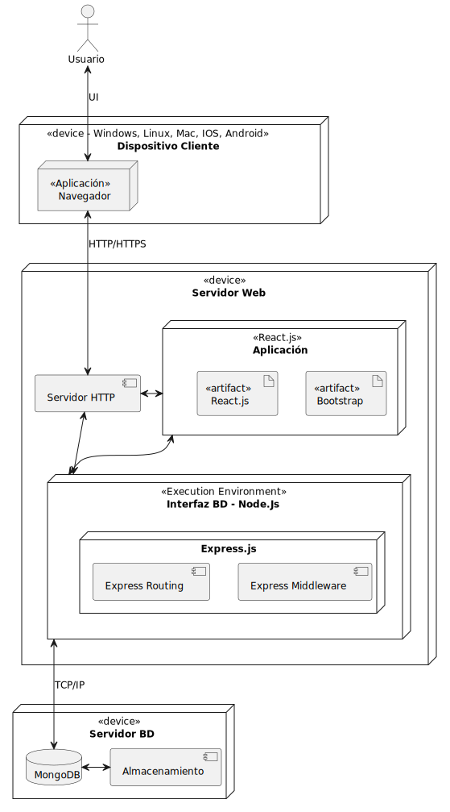

<!--  -->

**Diagrama 2** - _Diagrama de Despliegue del Sistema de Reserva para el Proyecto InstaYA_

[Regresar &#8617;](#tabla-de-contenido)

<div style="page-break-after: always"></div>

## Definición de Artefactos - Product Backlog

### Método de Estimación Fibonacci

<!-- prettier-ignore -->
| Calificación | Significado | Descripción |
| ------------ | ----------- | ----------- |
| 0            | **No requiere esfuerzo** | Requiere muy poco o ningún esfuerzo, pero no hay valor agregado para el negocio, entonces no acumula puntos para el trabajo.                                                                                                                                                                          |
| 1            | **Extrapequeño**         | Los desarrolladores sienten que entienden la mayoría de los requerimientos y los consideran relativamente fáciles, posiblemente el ítem más corto/pequeño del Sprint y realizable en un día.                                                                                                          |
| 2            | **Pequeño**              | Requiere de un poco de esfuerzo, y habilidades de resolución de problemas, pero los Desarrolladores ya han resuelto casos similares anteriormente, y sienten confianza con los requerimientos.                                                                                                        |
| 3            | **Promedio**             | Los Desarrolladores han resuelto muchas veces estos casos; saben lo que se necesita para culminar esta labor. Posiblemente se realicen unos pasos extra para resolverlo, y se logre el objetivo. Requiere muy poca o ninguna labor de investigación.                                                  |
| 5            | **Grande**               | Es un trabajo complejo, o los desarrolladores no realizan esta labor muy a menudo. La mayoría de los desarrolladores necesitarían asistencia de alguien más en el equipo. Es probablemente uno de los ítems más grandes por completar en un Sprint.                                                   |
| 8            | **Extragrande**          | Este tipo de ítems conlleva mucho tiempo e investigación y probablemente más de un desarrollador para completar dentro de un rango de dos semanas. Además, los desarrolladores necesitan hacer ciertas suposiciones que incrementan el riesgo y la culminación del ítem.                              |
| 13           | **¡Advertencia!**        | Es un trabajo muy complejo con mucha incertidumbre y requiere de múltiples suposiciones para dimensionar. Es mucho para completar en un Sprint. En cambio, se debería dividir en múltiples ítems que puedan ser completados de manera independiente.                                                  |
| 21           | **¡Riesgoso!**           | Un “21” o “34” refleja mucha complejidad para realizar en un sprint. Necesita más refinamiento. El gran tamaño indica mayor riesgo, suposiciones, y más dependencias involucradas para completar este tipo de ítems                                                                                   |
| ?            | **¡Peligro!**            | Como desarrollador, no queremos hacer este tipo de trabajo de la forma que se encuentra escrito. Presenta un alto grado de complejidad y no se puede completar en el marco de tiempo de un ciclo, iteración o Sprint. Tal vez los requerimientos son demasiado confusos que están plagados de peligro |

**Tabla 2** - Calificación por Método de Estimación Fibonacci [^fn2]

[Regresar &#8617;](#tabla-de-contenido)

<div style="page-break-after: always"></div>

### Product Backlog

<!-- prettier-ignore -->
| Id  | User Story | Estimación |
| --- | ---------- | ---------- |
| 01  | Cómo **cliente quiero** ingresar a la plataforma de InstaYA, **registrarme**, con mis datos de contacto y personales, **para acceder** a los servicios de la plataforma y posteriormente agendar mi entrega                                                                                  | 2 **Pequeño** |
| 02  | Cómo **cliente quiero** ver las horas de entrega disponibles **para seleccionar** a mi conveniencia la que se ajuste a mis necesidades.                                                                                                                                                      | 2 **Pequeño** |
| 03  | Cómo **cliente quiero** crear mi orden según el día, hora, las dimensiones del paquete, dirección de recogida, mis datos personales y los datos de entrega como la direccion, ciudad, identificación y nombre de quien recibe **para** que el envío sea realizado y entregado adecuadamente. | 2 **Pequeño** |
| 04  | Cómo **cliente quiero** hacer seguimiento a mis pedidos y ver el listado de los mismos con el estado actual del envío **para asegurarme** que los pedidos se estén entregando según los requerimientos (ejemplo: máximo en **24 horas**)                                                     | 2 **Pequeño** |
| 05  | Cómo **cliente quiero** actualizar los datos de mis órdenes realizadas con anterioridad **para poder** gestionarlas en caso de que algún dato haya cambiado o se haya digitado erróneamente.                                                                                                 | 2 **Pequeño** |

**Tabla 3** - Product Backlog

[Regresar &#8617;](#tabla-de-contenido)

<div style="page-break-after: always"></div>

### Sprint Backlog Entrega 1. Planificación

<!-- prettier-ignore -->
| Id   | Nombre | Descripción | Estimación | Responsable |
| ---- | ------ | ----------- | ---------- | ----------- |
| P-01 | Definición de Roles      | Documento con descripción de cada rol                                                                 | 2 **Pequeño** | Product Owner                   |
| P-02 | Diagrama de Despliegue   | Descripción de Componentes, Hardware, Software y Herramientas a utilizar                              | 2 **Pequeño** | Full-Stack                      |
| P-03 | Definición de artefactos | <ul><li>Backlog del producto<li>Backlog por sprint<li>Asignación de backlogs a cada rol definido</ul> | 2 **Pequeño** | Product Owner<br>& Team         |
| P-04 | Definición Cronograma    | Definir fechas para cada una de las actividades definidas                                             | 2 **Pequeño** | Scrum Master<br>& Product Owner |

**Tabla 4** - Sprint Backlog - Entrega #1 - Planificación

[Regresar &#8617;](#tabla-de-contenido)

<div style="page-break-after: always"></div>

### Sprint Backlog Entrega 2. Diseño

<!-- prettier-ignore -->
| Id  | User Story | Descripción | Estimación | Responsable |
| --- | ---------- | ----------- | ---------- | ----------- |
| D-01  | Cómo **cliente quiero** ingresar a la plataforma de InstaYA, **registrarme**, con mis datos de contacto y personales, **para acceder** a los servicios de la plataforma y posteriormente agendar mi entrega                                                                                  | Diseño de la vista de login y de regitro de usuario nuevo. Creación de la ventana del login, con estilos de bootstrap, y del registro de nuevo usuario con los botones y links de acceso a cada uno<ul><li>Ventana Login<li>Ventana Registro Nuevo Usuario</ul>                                                                                                                                                                                                                                                                                               | 3 **Promedio** | Full-Stack<ul><li>JesúsVA</ul> front-End<ul><li>AngelDM<br>DanielaOR</ul>                                                        |
| D-02  | Cómo **cliente quiero** ver las horas de entrega disponibles **para seleccionar** a mi conveniencia la que se ajuste a mis necesidades.                                                                                                                                                      | Creación de la vista de horarios disponibles por medio de boostrap, los botones y cuadros necesarios donde se observen las horas disponibles para recogida y envíos.<ul><li>BD Pedidos</li><ul><li>Fechas</li></ul><li>Vista Agendar Entrega</li><ul><li>Fechas Disponibles</li></ul></ul>                                                                                                                                                                                                                                                                    | 2 **Pequeño**  | Full-Stack<ul><li>AngelDM<li>DaritzaTV<li>JesúsVA</ul> Full-Stack<ul><li>JesúsVA</ul> Front-End<ul><li>AngelDM<li>DanielaOR</ul> |
| D-03  | Cómo **cliente quiero** crear mi orden según el día, hora, las dimensiones del paquete, dirección de recogida, mis datos personales y los datos de entrega como la direccion, ciudad, identificación y nombre de quien recibe **para** que el envío sea realizado y entregado adecuadamente. | Creación de la ventana de ingresar o crear orden de envío con los cuadros de texto para digitar la información correspondiente y los botones que guarden la información digitada en el frontend.<ul><li>BD Envíos<ul><li>Mercancía</li><ul><li>Dimensiones</li><li>Peso</li></ul></li><li>Remitente</li><ul><li>Fecha Recogida</li><li>Identificación</li><li>Nombre Completo</li><li>Dirección recogida/ciudad</li></ul><li>Destinatario</li><ul><li>Fecha Entrega</li><li>Identificación</li><li>Nombre Completo</li><li>Dirección entrega/ciudad</li></ul> | 3 **Promedio** | Full-Stack<ul><li>JesúsVA</ul> Front-End<ul><li>AngelDM<li>DanielaOR</ul>                                                        |
| D-04  | Cómo **cliente quiero** hacer seguimiento a mis pedidos y ver el listado de los mismos con el estado actual del envío **para asegurarme** que los pedidos se estén entregando según los requerimientos (ejemplo: máximo en **24 horas**)                                                     | Creación de la vista del resumen de los pedidos donde se pueda observar todo el listado de pedidos según su estado. Al seleccionar en un pedido debe dirigir a la ventana para ver/actualizar la información según su estado. Si ya fue cumplido o cancelado no se pueden modificar datos.<ul><li>BD Actualización & Registro Listado Ordenes</li><ul><li>Código de Seguimiento</li><li>Estado Envio</li><ul><li>Guardado</li><li>Cancelado</li><li>Cumplido                                                                                                  | 3 **Promedio** | Front-End<ul><li>AngelDM<li>DanielaOR</ul>                                                                                       |
| D-05  | Cómo **cliente quiero** actualizar los datos de mis órdenes realizadas con anterioridad **para poder** gestionarlas en caso de que algún dato haya cambiado o se haya digitado erróneamente.                                                                                                 | Creación de la ventana de actualización de pedido donde se pueda ver y/o modificar algún dato del pedido o cancelar el mismo. Esto sólo se podrá realizar en pedidos que aún no se hayan cumplido ni cancelado. Una vez Se guarden los datos, el frontend los almacenará para enviarlos al backend.<ul><li>Gestión de envíos/paquetes<ul><li>Actualización del paquete</li><li>Actualización datos Remitente</li><li>Actualización datos Destinatario</li></ul></ul>                                                                                          | 3 **Promedio** | Front-End<ul><li>AngelDM<li>DanielaOR</ul>                                                                                       |

**Tabla 5** - Sprint Backlog - Entrega #2 - Diseño

[Regresar &#8617;](#tabla-de-contenido)

<div style="page-break-after: always"></div>

### Sprint Backlog Entrega 3. Desarrollo Front-End

<!-- prettier-ignore -->
| Id  | User Story | Descripción | Estimación | Responsable |
| --- | ---------- | ----------- | ---------- | ----------- |
| DF-01  | Cómo **cliente quiero** ingresar a la plataforma de InstaYA, **registrarme**, con mis datos de contacto y personales, **para acceder** a los servicios de la plataforma y posteriormente agendar mi entrega                                                                                  | Creación de API Rest con método put o post, obtención de datos digitados por el usuario, conexión con base de datos y creación de sentencias para la funcionalidad de guardado de información en la BD.<ul><li>Ventana Login<li>Ventana Registro Nuevo Usuario</ul>                                                                                                                                                                                                                                                                                                               | 5 **Grande**   | back-End<ul><li>DaritzaTV<br>JavierTV</ul>                                                                           |
| DF-02  | Cómo **cliente quiero** ver las horas de entrega disponibles **para seleccionar** a mi conveniencia la que se ajuste a mis necesidades.                                                                                                                                                      | Desarrollo del API Rest con método Get para obtener los datos del usuario a buscar, conexión con base de datos y realización de sentencia para búsqueda de la información. Envío de los datos encontrados al front-end para que estos lo muestren en pantalla. <ul><li>BD Pedidos</li><ul><li>Fechas</li></ul><li>Vista Agendar Entrega</li><ul><li>Fechas Disponibles</li></ul></ul>                                                                                                                                                                                             | 3 **Promedio** | Full-Stack<ul><li>JesúsVA</ul> front-End<ul><li>AngelDM<br>DanielaOR</ul> back-End<ul><li>DaritzaTV<br>JavierTV</ul> |
| DF-03  | Cómo **cliente quiero** crear mi orden según el día, hora, las dimensiones del paquete, dirección de recogida, mis datos personales y los datos de entrega como la direccion, ciudad, identificación y nombre de quien recibe **para** que el envío sea realizado y entregado adecuadamente. | Obtener los datos de la orden de envío almacenados por el front-end y crear el API Rest put o post para la creación del envío en la base de datos, conectar con la BD. Enviar al front-end el éxito de la operación.<ul><li>BD Envíos<ul><li>Mercancía</li><ul><li>Dimensiones</li><li>Peso</li></ul></li><li>Remitente</li><ul><li>Fecha Recogida</li><li>Identificación</li><li>Nombre Completo</li><li>Dirección recogida/ciudad</li></ul><li>Destinatario</li><ul><li>Fecha Entrega</li><li>Identificación</li><li>Nombre Completo</li><li>Dirección entrega/ciudad</li></ul> | 5 **Grande**   | Full-Stack<ul><li>JesúsVA</ul> front-End<ul><li>AngelDM<br>DanielaOR</ul> back-End<ul><li>DaritzaTV<br>JavierTV</ul> |
| DF-04  | Cómo **cliente quiero** hacer seguimiento a mis pedidos y ver el listado de los mismos con el estado actual del envío **para asegurarme** que los pedidos se estén entregando según los requerimientos (ejemplo: máximo en **24 horas**)                                                     | Creación del API Rest Get para obtener el listado de envíos que un usuario tiene en la BD, conexión con la BD y devolver al front-end para que muestren en pantalla los resultados. <ul><li>BD Actualización & Registro Listado Ordenes</li><ul><li>Código de Seguimiento</li><li>Estado Envio</li><ul><li>Guardado</li><li>Cancelado</li><li>Cumplido                                                                                                                                                                                                                            | 3 **Promedio** | Full-Stack<ul><li>JesúsVA</ul> front-End<ul><li>AngelDM<br>DanielaOR</ul> back-End<ul><li>DaritzaTV<br>JavierTV</ul> |
| DF-05  | Cómo **cliente quiero** actualizar los datos de mis órdenes realizadas con anterioridad **para poder** gestionarlas en caso de que algún dato haya cambiado o se haya digitado erróneamente.                                                                                                 | Creación del API Rest put o post para actualización de la información del envío, conexión con BD y envío al front-end del éxito de la operación. <ul><li>Gestión de envíos/paquetes<ul><li>Actualización del paquete</li><li>Actualización datos Remitente</li><li>Actualización datos Destinatario</li></ul></ul>                                                                                                                                                                                                                                                                | 5 **Grande**   | Full-Stack<ul><li>JesúsVA</ul> front-End<ul><li>AngelDM<br>DanielaOR</ul> back-End<ul><li>DaritzaTV<br>JavierTV</ul> |

**Tabla 6** - Sprint Backlog - Entrega #3 - Desarrollo Front-End

[Regresar &#8617;](#tabla-de-contenido)

<div style="page-break-after: always"></div>

### Sprint Backlog Entrega 4. Desarrollo Back-End

<!-- prettier-ignore -->
| Id  | User Story | Descripción | Estimación | Responsable |
| --- | ---------- | ----------- | ---------- | ----------- |
| DB-01  | Cómo **cliente quiero** ingresar a la plataforma de InstaYA, **registrarme**, con mis datos de contacto y personales, **para acceder** a los servicios de la plataforma y posteriormente agendar mi entrega                                                                                  | Realizar los testing necesarios para la correcta creación del usuario y del ingreso a la plataforma del mismo. Esto incluye a las validaciones de la contraseña<ul><li>Ventana Login<li>Ventana Registro Nuevo Usuario</ul>                                                                                                                                                                                                                                                                                          | 5 **Grande**   | QA-QC<ul>JesúsVA<li>DaritzaTV<br>JavierTV</ul> |
| DB-02  | Cómo **cliente quiero** ver las horas de entrega disponibles **para seleccionar** a mi conveniencia la que se ajuste a mis necesidades.                                                                                                                                                      | Testing de los métodos Rest API utilizados y del correcto funcionamiento de la conexión con BD y que se muestren los datos en pantalla de los horarios disponibles <ul><li>BD Pedidos</li><ul><li>Fechas</li></ul><li>Vista Agendar Entrega</li><ul><li>Fechas Disponibles</li></ul></ul>                                                                                                                                                                                                                            | 3 **Promedio** | QA-QC<ul>JesúsVA<li>DaritzaTV<br>JavierTV</ul> |
| DB-03  | Cómo **cliente quiero** crear mi orden según el día, hora, las dimensiones del paquete, dirección de recogida, mis datos personales y los datos de entrega como la direccion, ciudad, identificación y nombre de quien recibe **para** que el envío sea realizado y entregado adecuadamente. | Testing de los métodos post y/put utilizados para la creación de una orden de envío, de la conexión con BD y mostrar mensaje del éxito de la operación.<ul><li>BD Envíos<ul><li>Mercancía</li><ul><li>Dimensiones</li><li>Peso</li></ul></li><li>Remitente</li><ul><li>Fecha Recogida</li><li>Identificación</li><li>Nombre Completo</li><li>Dirección recogida/ciudad</li></ul><li>Destinatario</li><ul><li>Fecha Entrega</li><li>Identificación</li><li>Nombre Completo</li><li>Dirección entrega/ciudad</li></ul> | 5 **Promedio** | QA-QC<ul>JesúsVA<li>DaritzaTV<br>JavierTV</ul> |
| 04  | Cómo **cliente quiero** hacer seguimiento a mis pedidos y ver el listado de los mismos con el estado actual del envío **para asegurarme** que los pedidos se estén entregando según los requerimientos (ejemplo: máximo en **24 horas**)                                                     | Testing al método get utilizado, la conexión con la BD y que los pedidos que se muestren en la ventana pertenezcan al usuario indicado y que su estado y datos obtenidos sean los correctos. <ul><li>BD Actualización & Registro Listado Ordenes</li><ul><li>Código de Seguimiento</li><li>Estado Envio</li><ul><li>Guardado</li><li>Cancelado</li><li>Cumplido                                                                                                                                                      | 3 **Promedio** | QA-QC<ul>JesúsVA<li>DaritzaTV<br>JavierTV</ul> |
| DB-05  | Cómo **cliente quiero** actualizar los datos de mis órdenes realizadas con anterioridad **para poder** gestionarlas en caso de que algún dato haya cambiado o se haya digitado erróneamente.                                                                                                 | Realizar las diferentes pruebas de testing sobre los métodos para la obtención de info (get) y de actualización (put o post) de la información. Se debe realizar la prueba que efectivamente la información seea actualizada. <ul><li>Gestión de envíos/paquetes<ul><li>Actualización del paquete</li><li>Actualización datos Remitente</li><li>Actualización datos Destinatario</li></ul></ul>                                                                                                                      | 5 **Grande**   | QA-QC<ul>JesúsVA<li>DaritzaTV<br>JavierTV</ul> |

**Tabla 7** - Sprint Backlog - Entrega #4 - Desarrollo Back-End

[Regresar &#8617;](#tabla-de-contenido)

<div style="page-break-after: always"></div>

## Cronograma de Proyecto - Sprint 1

<!-- TODO NOTA Este diagrama de gantt está realizado en plantuml pero al git no leer directamente este tipo de diagramas sino con una extensión que no he revisado bien, se puede trabajar externo e importarlo en SVG ó PNG -->
<!-- https://plantuml.com/gantt-diagram -->

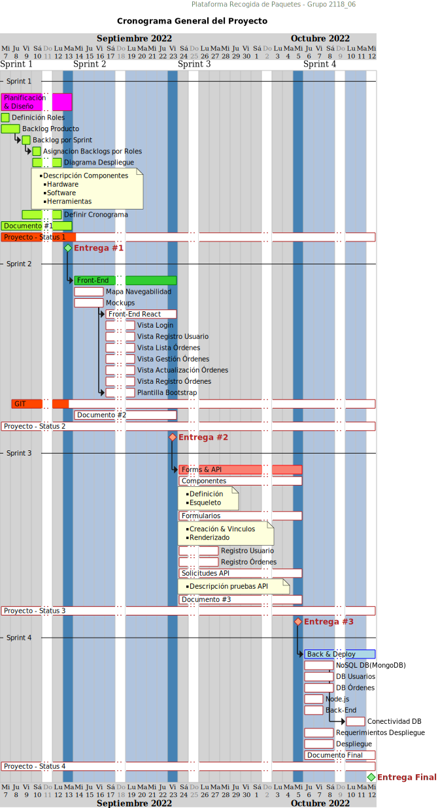

**Diagrama 3** - _Diagrama Gantt - Cronograma / Rúbrica General del Proyecto_

[Regresar &#8617;](#tabla-de-contenido)

<div style="page-break-after: always"></div>

## Cronograma de Proyecto - Sprint 2

<!-- TODO NOTA Este diagrama de gantt está realizado en plantuml pero al git no leer directamente este tipo de diagramas sino con una extensión que no he revisado bien, se puede trabajar externo e importarlo en SVG ó PNG -->
<!-- https://plantuml.com/gantt-diagram -->


**Diagrama 4** - _Diagrama Gantt - Cronograma / Rúbrica General del Proyecto para Sprint 2_

[Regresar &#8617;](#tabla-de-contenido)

<div style="page-break-after: always"></div>

## Mockups


**Imagen 1** - _Diseño de mockups trabajado en la plataforma Figma_


**Imagen 2** - _Vista Mockup Loading_

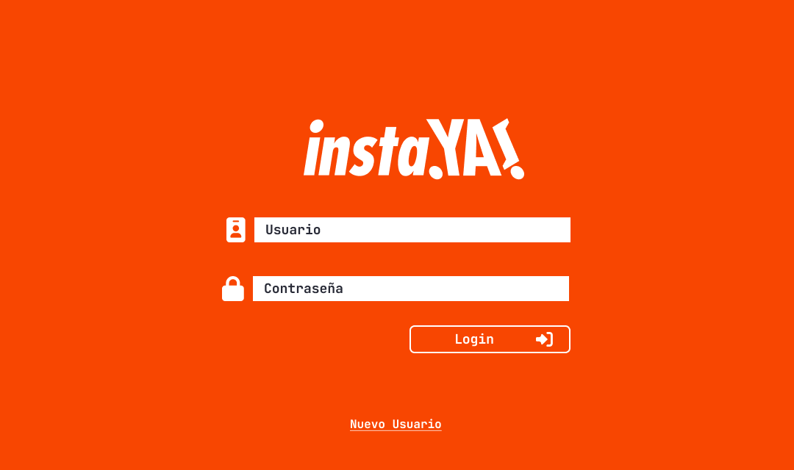
**Imagen 3** - _Vista Mockup Login_

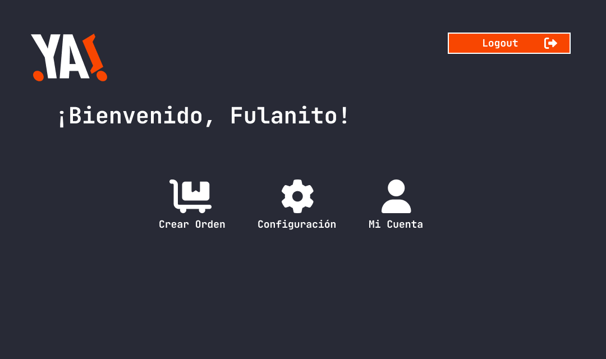
**Imagen 4** - _Vista Mockup Menu_

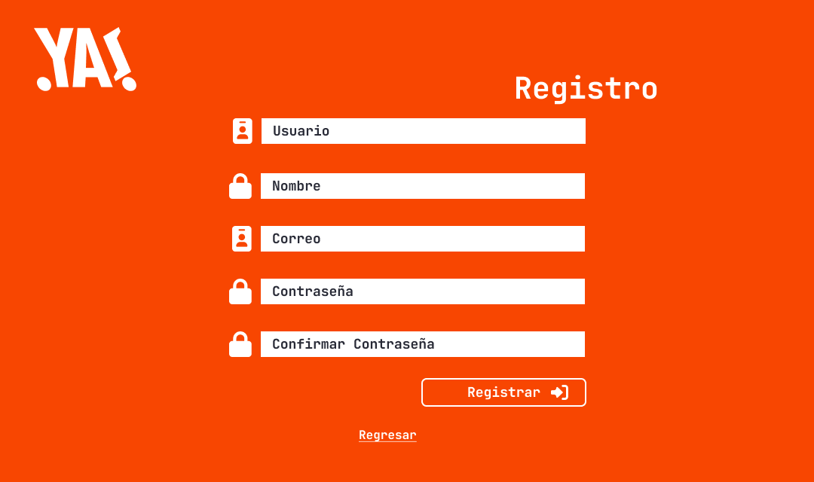
**Imagen 5** - _Vista Mockup Registro_

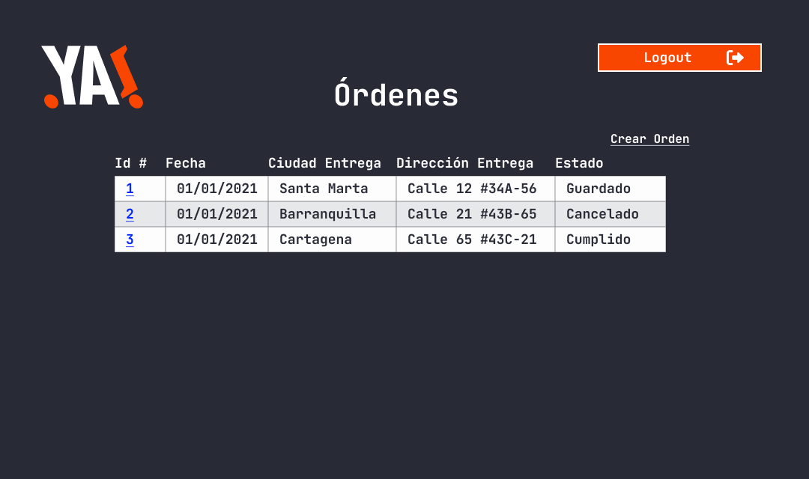
**Imagen 6** - _Vista Mockup Órdenes_

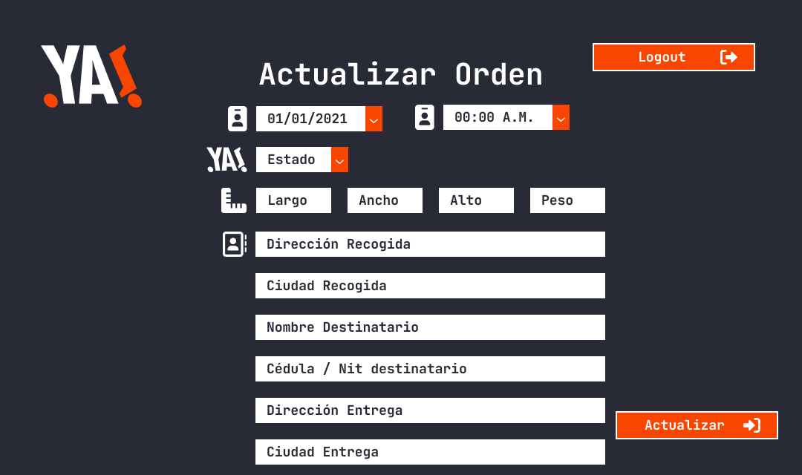
**Imagen 7** - _Vista Mockup Actualizar Orden_

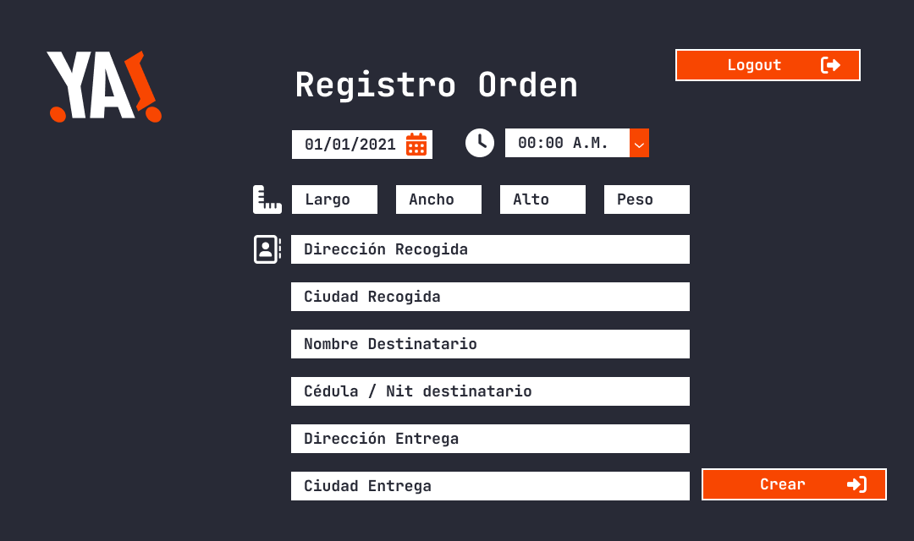
**Imagen 8** - _Vista Mockup Registro Orden_

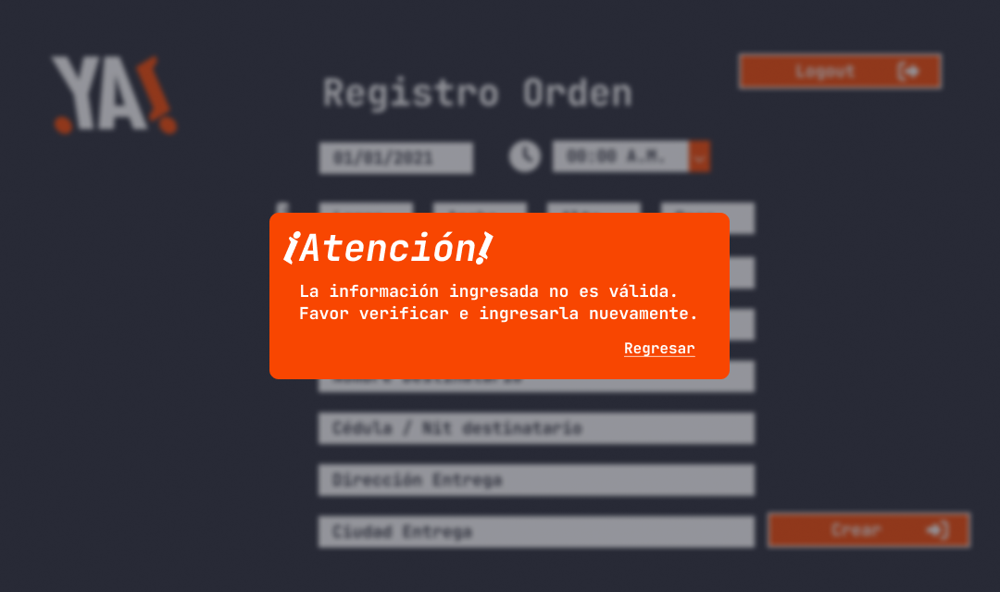
**Imagen 9** - _Vista Mockup Modales_

[Regresar &#8617;](#tabla-de-contenido)

<div style="page-break-after: always"></div>

## Mapa de Navegabilidad

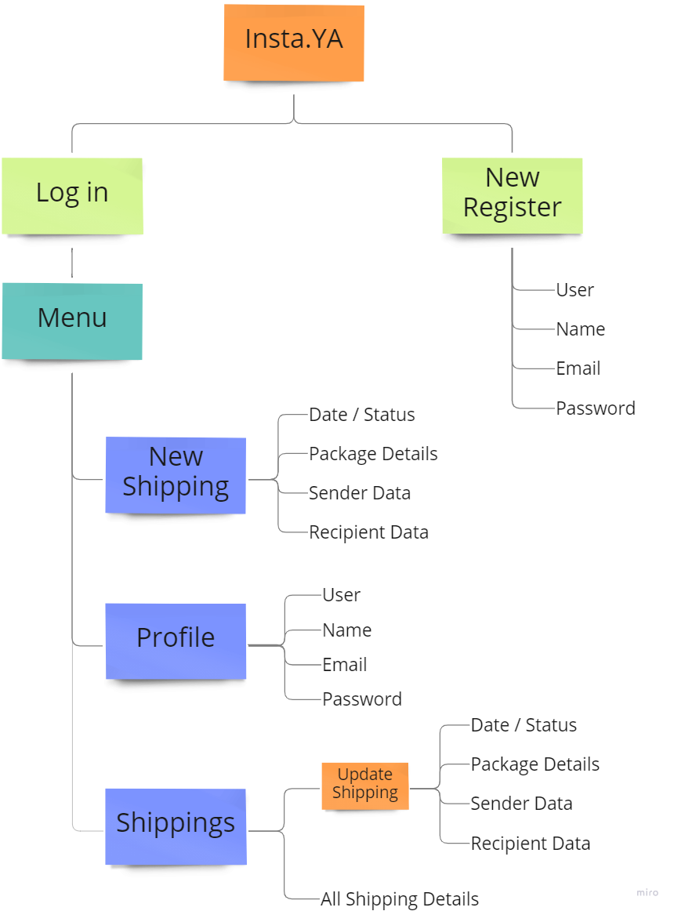

**Diagrama 5** - _Diagrama Mapa de Navegabilidad plataforma instaYa_

[Regresar &#8617;](#tabla-de-contenido)

<div style="page-break-after: always"></div>

## Plantilla Bootstrap

### Enlaces

https://react-bootstrap.github.io/

### Import

bootstrap/dist/css/bootstrap.min.css

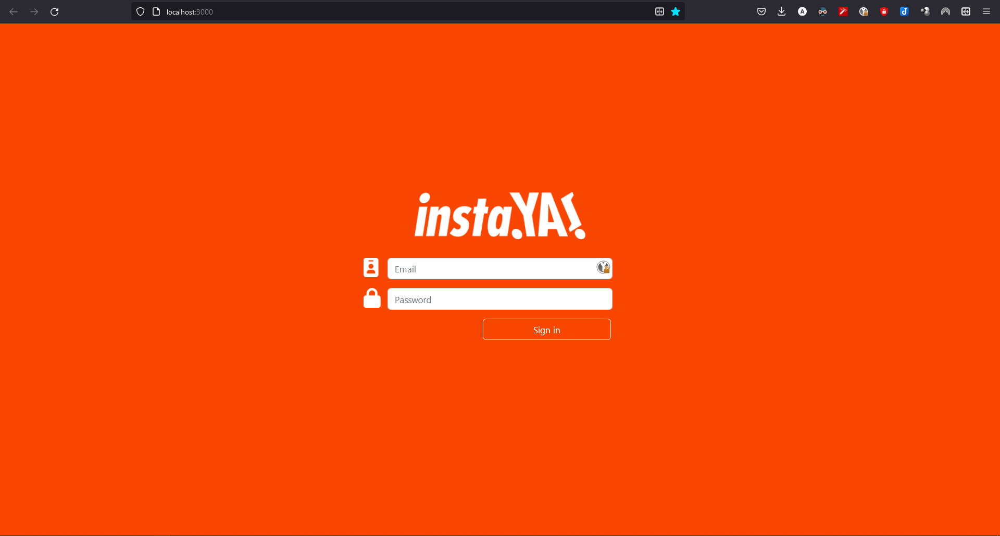
**Imagen 10** - _Test Vista Login Aplicación React & Bootstrap_

[Regresar &#8617;](#tabla-de-contenido)

<div style="page-break-after: always"></div>

## Creación proyecto en Git

### Github

<a href = https://github.com/proyectoCiclo4MinTic/instaYa.git>

</a>

***https://github.com/proyectoCiclo4MinTic/instaYa.git***

[Regresar &#8617;](#tabla-de-contenido)

## Requerimientos de Ejecución

```
nodejs
create-react-app
react-bootstrap
bootstrap
react-router-dom@5
```

[Regresar &#8617;](#tabla-de-contenido)

## Componentes desarrollados

<!-- prettier-ignore -->
| Componente  | Vista de la que hace parte | Vista previa |
| --- | ---------- | ----------- |
| LoginItem | Vista Mockup Login | 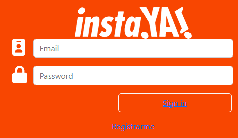 |
| Orders | Vista Mockup Órdenes |  |
| OrderItem | Vista Mockup Órdenes | 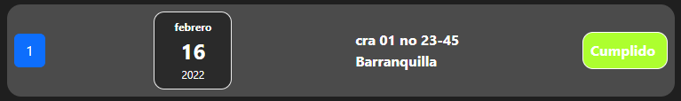 |
| OrderDate | Vista Mockup Órdenes | 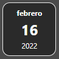 |
| OrderDestination | Vista Mockup Órdenes | 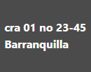 |
| OrderStatus | Vista Mockup Órdenes |  |
| OrderRegister | Vista Mockup Registro Orden | 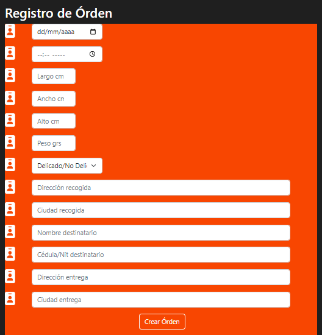 |
| OrderRegisterForm | Vista Mockup Registro Orden | 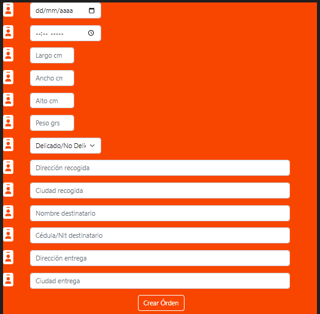 |
| OrderUpdate | Vista Mockup Actualizar Orden | 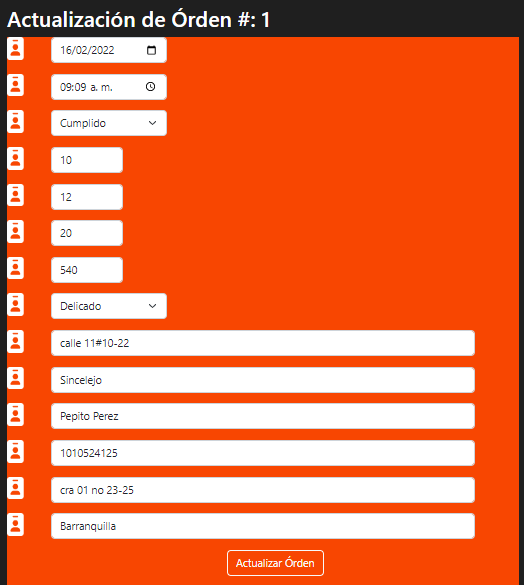 |
| RegisterUserItem | Vista Mockup Registro | 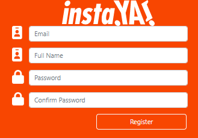 |

**Tabla 8** - Componentes desarrollados

[Regresar &#8617;](#tabla-de-contenido)

## Formularios desarrollados

<!-- prettier-ignore -->
| Formulario  | Vista de la que hace parte | Vista previa |
| --- | ---------- | ----------- |
| Login | Vista Mockup Login |  |
| Registro Nueva Orden | Vista Mockup Registro Orden |  |
| Actualización Orden | Vista Mockup Actualizar Orden |  |
| Registro Nuevo Usuario | Vista Mockup Registro |  |

**Tabla 9** - Formularios desarrollados

[Regresar &#8617;](#tabla-de-contenido)

<div style="page-break-after: always"></div>

## Cronograma de Proyecto - Sprint 3

<!-- TODO NOTA Este diagrama de gantt está realizado en plantuml pero al git no leer directamente este tipo de diagramas sino con una extensión que no he revisado bien, se puede trabajar externo e importarlo en SVG ó PNG -->
<!-- https://plantuml.com/gantt-diagram -->

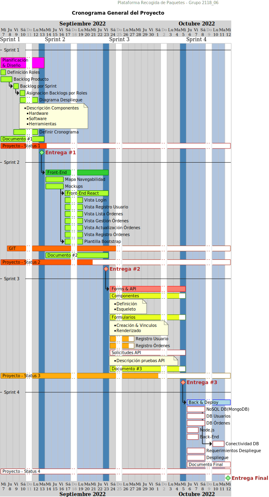

**Diagrama 6** - _Diagrama Gantt - Cronograma / Rúbrica General del Proyecto para Sprint 3_

[Regresar &#8617;](#tabla-de-contenido)


## Solicitudes a la API

<!-- prettier-ignore -->
| Vista  | Acción Backend | Descripción |
| ------ | -------------- | ----------- |
| Modelo de Órdenes | Listar todas las órdenes | Se realiza petición con método GET a la base de datos para generar listado de todas las órdenes creadas por el usuario que ha iniciado sesión |
| Login | Obtener usuario y contraseña | Se realiza petición GET a la base de datos para traer el usuario y contraseña, desencriptarla y compararlas con el usuario y contraseña digitadas para iniciar sesión |
| Formulario creación de usuarios | Guardar nuevo usuario | Se realiza petición GET con el nombre de usuario a la base de datos para comprobar que el usuario no exista y posteriormente una petición POST para crear al usuario y guardarlo en la BD |
| Formulario creción de orden | Guardar orden en la BD | Realizar petición POST a la base de datos para guardar la orden creada |
| Formulario Actualización de orden | Actualizar orden en la BD | Primero, realiza petición GET para traer los datos de la orden seleccionada. Una vez se guarden los datos nuevos, se realiza petición POST para actualizar los datos de esa orden en la BD |

**Tabla 10** - Solicitudes a la API

[Regresar &#8617;](#tabla-de-contenido)


## Listado de Dependencias

```json
  "dependencies": {
    "@fortawesome/fontawesome-svg-core": "^6.2.0",
    "@fortawesome/free-solid-svg-icons": "^6.2.0",
    "@fortawesome/react-fontawesome": "^0.2.0",
    "@testing-library/jest-dom": "^5.16.5",
    "@testing-library/react": "^13.4.0",
    "@testing-library/user-event": "^13.5.0",
    "bootstrap": "^5.2.1",
    "mongodb": "^4.10.0",
    "react": "^18.2.0",
    "react-bootstrap": "^2.5.0",
    "react-dom": "^18.2.0",
    "react-icons": "^4.4.0",
    "react-router-dom": "^6.4.2",
    "react-scripts": "5.0.1",
    "web-vitals": "^2.1.4"
  }
```


## Funcionalidades o módulos del Back-End

<!-- prettier-ignore -->
| Funcionalidad o módulo  | Descripción |
| ----------------------- | ----------- |
| Módulo de usuarios | Creación de usuario, lectura de datos de usuario |
| Módulo de autenticación | Registro de un usuario, inicio de sesión con verificación y codificación hash | 
| Módulo de órdenes | CRUD de órdenes. Incluye lista de órdenes, creación de órdenes y actualización de órdenes |

**Tabla 11** - Funcionalidades o módulos del Back-End

[Regresar &#8617;](#tabla-de-contenido)

## Despliegue

Se generó un error en el intento de realizar el despliegue y no hubo tiempo de corregirlo. Se muestra evidencia

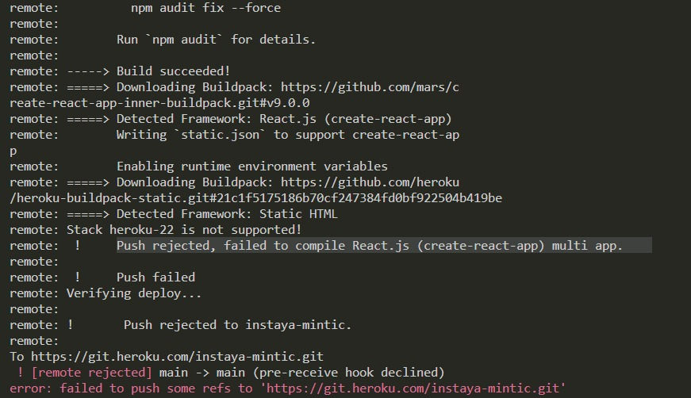
**Imagen 11** - _Error Despliegue_

[^fn1]: Ministerio de Comercio, Industria y Turismo.(5 de mayo de 2022). _Políticas de tratamiento de datos personales_. https://www.mincit.gov.co/servicio-ciudadano/politicas-de-tratamiento-de-datos-personales
[^fn2]: Everet, J. (2021). _Practical Fibonacci: A Beginner's Guide to Relative Sizing_ [Tabla]. > Recuperado de https://www.scrum.org/resources/blog/practical-fibonacci-beginners-guide-relative-sizing
